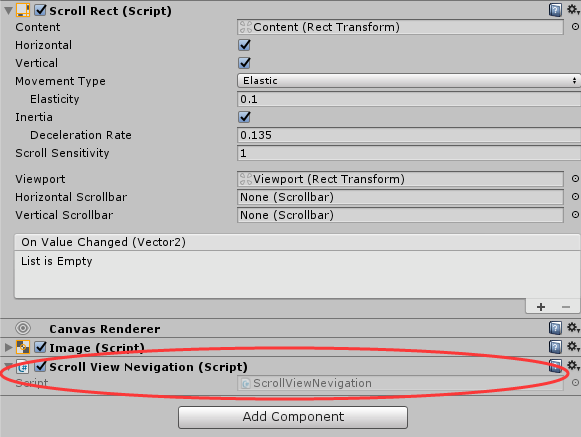

# Unity-ScrollViewNevigation

### 1. 简介

在Unity3D中，使用ScrollView时，

经常需要让游戏在运行时，将ScrollView定位到某一指定Item上。

比如：进入游戏后，在关卡界面大地图推图指当前关卡等。

**脚本`ScrollViewNevigation.cs`  则可以实现此功能**。


### 2. 使用说明

- 请尽量保证ScrollView组件**层级及命名**如下，为减少使用者拖拽工作量，在代码中已根据层级和命名初始化完毕


​	

- 将脚本`ScrollViewNevigation.cs` 挂在 ScrollView 上



​	

- 调用其中方法`Nevigate()`即可

  ```c#
  void Nevigate(RectTransform item)
  ```

  例如：`Nevigate(content.GetChild(45).GetComponent<RectTransform>());`

  ​


- 在脚本中，为了实现平滑移动而定位的效果，使用了**DoTween**插件